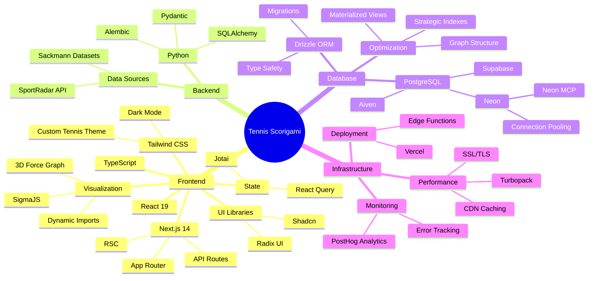
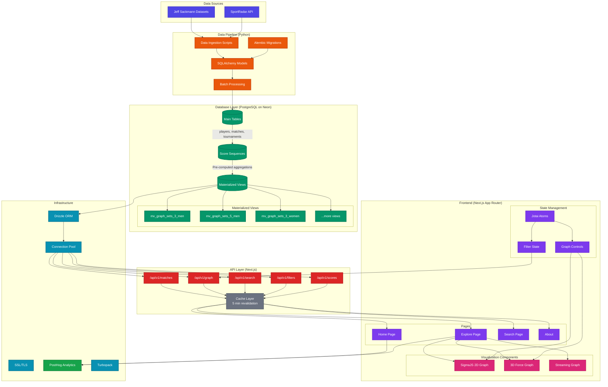

This post is going to be focused on discussing how we built our [Tennis Scorigami][ts] project from a technical standpoint. I'll discuss the current architecture, some of the design decisions I made, and where I want the project to go next.

If you haven't yet checked out the main site, feel free to here:

<div class="tennis-scorigami-unfurl">
  <a href="https://www.tennis-scorigami.com/" target="_blank" rel="noopener noreferrer">
    <div class="unfurl-container">
      <video autoplay loop muted playsinline class="unfurl-video">
        <source src="/videos/tennis-scorigami/hero-section.mp4" type="video/mp4">
      </video>
      <div class="unfurl-overlay">
        <div class="unfurl-content">
          <h3 class="unfurl-title">Tennis Scorigami</h3>
          <p class="unfurl-domain">tennis-scorigami.com</p>
        </div>
      </div>
    </div>
  </a>
</div>

<style>
.tennis-scorigami-unfurl {
  margin: 2rem 0;
  border-radius: 12px;
  overflow: hidden;
  box-shadow: 0 4px 6px -1px rgba(0, 0, 0, 0.1), 0 2px 4px -1px rgba(0, 0, 0, 0.06);
  transition: transform 0.2s ease, box-shadow 0.2s ease;
}

.tennis-scorigami-unfurl:hover {
  transform: translateY(-2px);
  box-shadow: 0 10px 15px -3px rgba(0, 0, 0, 0.1), 0 4px 6px -2px rgba(0, 0, 0, 0.05);
}

.tennis-scorigami-unfurl a {
  text-decoration: none;
  color: inherit;
}

.unfurl-container {
  position: relative;
  width: 100%;
  background: #1a1a2e;
  cursor: pointer;
}

.unfurl-video {
  width: 100%;
  height: auto;
  display: block;
  object-fit: cover;
  max-height: 400px;
}

.unfurl-overlay {
  position: absolute;
  bottom: 0;
  left: 0;
  right: 0;
  background: linear-gradient(to top, rgba(0, 0, 0, 0.9) 0%, rgba(0, 0, 0, 0.7) 50%, transparent 100%);
  padding: 3rem 2rem 1.5rem;
}

.unfurl-content {
  color: white;
  max-width: 600px;
}

.unfurl-title {
  font-size: 1.75rem;
  font-weight: 700;
  margin: 0 0 0.25rem 0;
  color: #ffffff;
}

.unfurl-domain {
  font-size: 1rem;
  margin: 0 0 0.5rem 0;
  color: #a8b2d1;
  font-weight: 400;
}

@media (max-width: 768px) {
  .unfurl-video {
    max-height: 250px;
  }
  
  .unfurl-overlay {
    padding: 2rem 1.5rem 1rem;
  }
  
  .unfurl-title {
    font-size: 1.5rem;
  }
  
  .unfurl-domain {
    font-size: 0.875rem;
  }
  
  .unfurl-date {
    right: 1.5rem;
  }
}
</style>

# Table of Contents

- [Table of Contents](#table-of-contents)
- [Motivation](#motivation)
  - [More Specific Motivation](#more-specific-motivation)
- [Demo](#demo)
- [Features](#features)
- [Challenges](#challenges)
  - [Data Consolidation](#data-consolidation)
  - [Being Cheap](#being-cheap)
  - [Fetching 108k Nodes](#fetching-108k-nodes)
  - [Rendering 108k Nodes](#rendering-108k-nodes)
    - [2D Sigma Graph](#2d-sigma-graph)
    - [3D Force Graph](#3d-force-graph)
    - [Streaming + NDJSON](#streaming--ndjson)
  - [Unfurl Previews](#unfurl-previews)
- [Surprises](#surprises)
- [Tech Stack](#tech-stack)
- [Engineering + Design](#engineering--design)
- [Other Fun Visualizations](#other-fun-visualizations)
  - [Player Rank History](#player-rank-history)
- [Conclusion](#conclusion)

# Motivation

Given once again, the impending collapse of my profession due to automation, my lack of time, and the fact that there's details on the main website, I will try not to repeat myself.

Our motivation here was largely love of tennis, data, and friendship. [Sebastian][seb] and [Henry][hen] were chatting in the groupchat about football scorigami, and Seb asked, I wonder if tennis has any scorigamis. And so, began an interesting conversation, and the groupchat started to explore where we could get data, if anyone had done this and all of that.

## More Specific Motivation

More specifically, besides my craving to "wow" my friends, the real pie in the sky goal for us (read: [me][john]), was to get [Andy Roddick][roddick] to re-tweet / view this project.

{: .center-super-shrink}

Andy Roddick has been one of our favorite tennis players since growing up, and [Henry][hen] and I watched as many of his matches as we could get a hold of. So that target was a stretch New Years Resolution of mine.

# Demo

If you're too lazy to visit the [website and explore][ts-explore], here's a demo:

<div class="video-container">
  <div class="video-wrapper-dark">
    <video 
      src="https://www.dropbox.com/scl/fi/96xzymtsl5j7zkbgdh2gu/tennis-scorigami-demo-smaller.mp4?rlkey=da9r4uyuj45wpakl4daffkyqw&st=7txvjr91&raw=1"
      muted
      autoplay
      loop
      controls
      style="width: 100%; height: auto;">
    </video>
  </div>
</div>

# Features

There's numerous features here that we're proud of. I'm going to list some of them, and then I'll discuss them in further detail below:

- **Graph-Based Score Sequence Modeling**
  - this was originally [Henry's][hen] idea but given how many nodes we have in this search space, it's not as feasible to just arrange it as a grid like with the NFL
  - we thought a graph as a novel (and visually appealing approach)
  - what this means technically is that we pre-computed all permutations and did some background processing so that we could store this information in as close to frontend ready format for fast visualization and processing... that gets into our next point
- **Performance-Optimized Materialized Views**
  - we built out specific materialized views to help with the performance (given our existing FE filters) so that we can ensure latency is not noticeable
- **Streaming Visualizations**
  - Still kind of working on setting this up ideally for 5-graph nodes. There's 125,062 nodes that we need to render for 5 set match permutations.
  - I had to turn to [NDJSON][ndjson] (basically just newline json chunked) which I had never used before
  - This helped reduce both the latency and the incremental memory on receiving that information and parsing it on the FE
- **[Drizzle][drizzle]**
  - Ok fair fine you got me. Technically I used both SQLAlchemy and then ported over to Drizzle so that was a little bit of a mess, but I have heard great things about drizzle and liked that experience a lot. `drizzle-kit` is very sleek and the latest major release for drizzle is fantastic.
- **(somewhat?) Decent Testing**
  - Yeah, obviously I wouldn't say I went crazy here, but I did set up [`jest`][jest], [`playwright`][playwright], and [`storybook`][storybook]
  - These are all things that the very talented [Michael Barlock][barlock] first introduced to the team.
  - I learned a lot from him and since then, yeah I've been trying to incorporate / adopt these a bit more
- **Unfurl Link Coverage**
  - Perhaps trivial, but try sending `https://tennis-scorigami.com/` over iMessage? Yup, it uses the mp4 video with autoplay. What about over Discord? Falls to the native sub-5MB gif that plays. LinkedIn? That same gif? Twitter - just uses a static image as a fallback, and Slack? Also has coverage with the gif / animation support.
  - I spent a non-trivial amount on this because it's the little details that might help Andy Roddick actually click retweet (although yeah I should probably fix that Twitter share link then)

# Challenges

## Data Consolidation

<div class="markdown-alert markdown-alert-disclaimer">
<p>There's a couple important notes I want to make here.</p>

<p>Our data cutoff is then (partially) hinged on <a href="https://github.com/jeffsackmann">Jeff Sackmann</a>. Currently it's good until the end of 2024. I hate that. I'm not running LLMs, I shouldn't have a data cutoff. I'm planning on building a web scraper for ATP results and setting up my own data feeds because why the f not, and it's 2025 and you can roll (most) software if push really comes to shove. I can go on a full blown rant on my Substack or something, but I am aware of this limitation, and I dislike it more than you.</p>

<p>Secondly, consolidating all of this data from disparate sources, always prevents a challenge. There's the age old problem of same logical data, but different source ingestion. I have pulled some of the 2024 matches with SportRadar, and with RapidApi, and with Sackmann, so consolidating that was definitely a bit of elbow grease. Obviously, I used LLMs for parts of this project, but that part was probably the most hands on and driven. Yes, don't worry - I set up my <a href="https://www.npmjs.com/package/@modelcontextprotocol/server-postgres">Postgres MCP</a> and after porting to Neon I set up my <a href="https://neon.com/docs/ai/neon-mcp-server">Neon MCP</a>, but man yeah... still early days I suppose.</p>

</div>
<br>

Again, as referenced [here][ts-data-collection], tennis data is a commodity. It is insanely annoying and hard to get clean data. I am adamant that another side project that will spin out of this is a publicly available free API for people to query and get tennis data from.

I tried numerous things:

- [SportRadar][sr]
  - they're one of the world's best data providers
  - however, they are absurdly expensive. there's more info in the Reddit below but they don't have set plans. as of 2 years ago, for a small time project, they were $1250 a month
  - I tried their free trial, ripped as much as I could (of recent tournaments), and then got rate limited, and my trial expired
  - Needless to say that was a bit of a miss

<blockquote class="reddit-embed-bq" style="height:316px" data-embed-theme="dark" data-embed-height="356"><a href="https://www.reddit.com/r/Sportradar/comments/s9j4tl/api_pricing/">API Pricing?</a><br> by<a href=""></a> in<a href="https://www.reddit.com/r/Sportradar/">Sportradar</a></blockquote><script async="" src="https://embed.reddit.com/widgets.js" charset="UTF-8"></script>

- (continuation)
  - one nice thing about SportRadar though was that they publish an `OpenAPI` (API not AI 🙄) spec of their endpoints.
  - You can see their [Swagger docs here][sr-swagger], and download the `openapi.yaml` file [here][sr-openapi-yaml]
  - This made generating a Python client for interacting with it very easy.
  - I even created a SportRadar specific Python client for this.
  - That repo was (more or less) entirely created with: `openapi-python-client generate --path ~/Downloads/openapi.yaml --config tennis-config.yaml` with my `tennis-config.yaml` being as simple as:

```yaml
project_name_override: sportradar-tennis-v3
package_name_override: sportradar_tennis_v3
```

[**Check out the GH repo for the SportRadar client here**][sr-github-client]



- [RapidApi][rapidapi]
  - Ok but I moved on rapidly (pun intended), because I wasn't about to pay $1250 a month (unless I was running betting strats)
  - I switched to [RapidAPI][rapidapi] given their generous free plans
  - The data quality also suffered here, and a lot of the APIs had pretty stringent API limits (2k calls _per month_)
  - Given this I eventually turned away after pulling what I could
- [Sackmann][sackmann]
  - I seriously need to buy Jeff Sackmann a beer
  - He's consolidated **years** of tennis data into a decently well organized format
  - Sure there's duplicate players, strange score formats, partial data, conflicts with accents, etc
  - Lots of the traditional data quality things, but it's easier to go from an excess and cleanse than to pull the data out of thin air
  - So we stuck with Jeff for our historical data

## Being Cheap

This one will be quick, but another challenge of this was just my desire to not spend money. Specifically for a hosted database service. I started with [Supabase][supa] which I love and use for many other projects, but then pivoted to [Aiven][aiven] which I honestly liked anymore. However, they didn't have connection pooling and I figured if this did go viral that I would get burned and people would say I was a bad engineer if we were throttling on Aiven's free plan of like 10 open db transactions. So finally, I ended up [Neon][neon] because I've been wanting to try them and they're slightly cheaper than [Supabase][supa]. Here's an AI generated table summarizing the pros and cons, and decisions:

<div class="markdown-alert markdown-alert-ai">
<p>This table was generated using AI.</p>
</div>

| Provider         | Pros                                                                                                           | Cons                                                                                   | Decision Rationale                                                              |
| ---------------- | -------------------------------------------------------------------------------------------------------------- | -------------------------------------------------------------------------------------- | ------------------------------------------------------------------------------- |
| [Supabase][supa] | - Great developer experience<br>- Integrated auth + storage<br>- Rich UI/dashboard                             | - Slightly pricier for scaling<br>- Overhead from extra services if only DB is needed  | Preferred for full-stack apps, but overkill + cost when only DB needed          |
| [Aiven][aiven]   | - Excellent reliability<br>- Flexible managed Postgres<br>- Simple CLI/tools                                   | - No built-in connection pooling<br>- Free tier limit: \~10 connections                | Risky for viral spikes; free tier would throttle app & reflect poorly on eng.   |
| [Neon][neon]     | - Built-in connection pooling<br>- Autoscaling<br>- Cheaper than Supabase<br>- Separation of storage & compute | - Newer platform, less mature<br>- Limited ecosystem/integrations compared to Supabase | Chosen for price/perf tradeoff; avoids pooling issues; good opportunity to test |

## Fetching 108k Nodes

This was actually pretty fine truth be told in terms of backend performances. The large win of utilizing [materialized views][mat-view] was that I could pull the pertinent information, and shape it into the appropriate information that my various FE graph information would require.

Once we get to live data, I'll set up cronjobs or triggers to refresh these and build out my data pipeline a bit more. However, for the moment, these materialized views were sufficient.

Here's one as an example:

```sql
CREATE MATERIALIZED VIEW public.mv_slug_stats_3_men
TABLESPACE pg_default
AS SELECT s.event_id,
    ss.sequence_id AS id,
    ss.slug,
    ss.depth,
    ss.winner_sets,
    ss.loser_sets,
    is_terminal_3(ss.winner_sets, ss.loser_sets) AS is_terminal,
    3 AS best_of,
    COALESCE(s.played, false) AS played,
    COALESCE(s.occurrences, 0) AS occurrences
   FROM score_sequence ss
     LEFT JOIN mv_sequence_stats_3_men s ON s.sequence_id = ss.sequence_id
  WHERE ss.best_of <= 3
WITH DATA;

-- this is so that we can filter by event_id which is what happens on the frontend when
-- a user selects either a tournament or a year (more or less)
CREATE INDEX idx_mv_slug_stats_3_men_event ON public.mv_slug_stats_3_men USING btree (event_id);
```

## Rendering 108k Nodes

There are numerous repos (some of which I'm using) to help process and render beautiful graphics. I didn't roll my own physics engine or the force-graph library. I used these:

### 2D Sigma Graph



### 3D Force Graph



Regardless, I wanted a very slick and performant frontend to render all these nodes. The 5 set 3d force graph is not yet built out. You'll note that `vasturiano` has a large graph demo [here][v-large-force-graph]:

<div style="text-align: center;">
<iframe src="https://vasturiano.github.io/react-force-graph/example/large-graph/" 
        width="800px" 
        height="600px" 
        frameborder="0" 
        ></iframe>
</div>

And that looks fantastic. However, if you look at the source code...

```javascript
// https://github.com/vasturiano/react-force-graph/blob/master/example/large-graph/index.html
<head>
  <style> body { margin: 0; } </style>

  <script type="importmap">{ "imports": {
    "react": "https://esm.sh/react",
    "react-dom": "https://esm.sh/react-dom/client"
  }}</script>

<!--  <script type="module">import * as React from 'react'; window.React = React;</script>-->
<!--  <script src="../../src/packages/react-force-graph-3d/dist/react-force-graph-3d.js" defer></script>-->
</head>

<body>
  <div id="graph"></div>

  <script src="//cdn.jsdelivr.net/npm/@babel/standalone"></script>
  <script type="text/jsx" data-type="module">
    import ForceGraph3D from 'https://esm.sh/react-force-graph-3d?external=react';
    import React from 'react';
    import { createRoot } from 'react-dom';

    fetch('../datasets/blocks.json').then(res => res.json()).then(data => {
      createRoot(document.getElementById('graph')).render(
        <ForceGraph3D
          graphData={data}
          nodeLabel={node => <div><b>{node.user}</b>: {node.description}</div>}
          nodeAutoColorBy="user"
          linkDirectionalParticles={1}
        />
      );
    });
  </script>
</body>
```

And then look at the underlying `../datasets/blocks.json` and then do a little bit of Python / json handling... you'll note:

```shell
╭─johnlarkin@Mac ~/Documents/coding/tennis-scorigami ‹feature/john/example-blog-post*›
╰─➤  python                                                                                                                          127 ↵
Python 3.11.7 (v3.11.7:fa7a6f2303, Dec  4 2023, 15:22:56) [Clang 13.0.0 (clang-1300.0.29.30)] on darwin
Type "help", "copyright", "credits" or "license" for more information.
>>> import json
>>> import sys
>>> from pathlib import Path
>>> raw_path = Path('/Users/johnlarkin/Downloads/blocks.json')
>>> raw_content = raw_path.read_text()
>>> data = json.loads(raw_content)
>>> data['nodes'][:2]
[{'id': '4062045', 'user': 'mbostock', 'description': 'Force-Directed Graph'}, {'id': '1341021', 'user': 'mbostock', 'description': 'Parallel Coordinates'}]
>>> len(data['nodes'])
1238 # ... so... not actually that large
>>> len(data['links'])
2602
```

So... compared to 108k nodes and a similar number of edges... not exactly a port and shift.

---

However, the 2d sigma graph (with a bit of streaming) can handle this with relative ease. Note, we are playing a bit of a visual game with doing some edge reduction for the farther out layers for 5 graphs, basically following this logic:

```typescript
edgesToRender = data.edges.filter((edge) => {
  const fromNode = nodeMap.get(edge.frm);
  const toNode = nodeMap.get(edge.to);

  if (!fromNode || !toNode) return false;

  // Always keep early depth edges (structure)
  if (Math.max(fromNode.depth, toNode.depth) <= 2) return true;

  // Keep edges to/from unscored nodes (discovery)
  if (!fromNode.played || !toNode.played) return true;

  // Keep edges with high occurrence nodes
  if (fromNode.occurrences > 100 || toNode.occurrences > 100) return true;

  // For deeper levels, only keep a sample
  return Math.random() < 0.1; // Keep 10% of remaining edges
});
```

### Streaming + NDJSON

However, the crux of keeping the frontend still lightweight for the 5 set rendering was to use NDJSON.

I had heard of NDJSON as a streaming mechanism but hadn't used it in a production workflow. However, [Claude][claude] obviously was a huge help here and took care of implementing that part. The crux of the code looks like this:

```typescript
const response = await fetchGraphStream({
  /* {...filters} */
  maxEdgesPerDepth: GRAPH_CONFIG.maxEdgesPerDepth,
  minOccurrences: GRAPH_CONFIG.minOccurrences,
  signal: abortController.signal,
});

const reader = response.body.getReader();
const decoder = new TextDecoder();
let buffer = "";

/* more code here */

while (true) {
  const { done, value } = await reader.read();
  if (done) break;

  buffer += decoder.decode(value, { stream: true });
  const lines = buffer.split("\n");
  buffer = lines.pop() || "";

  for (const line of lines) {
    if (!line.trim()) continue;

    try {
      const message: StreamMessage = JSON.parse(line);

      switch (message.type) {
        case "meta":
          streamTotalNodes = message.totalNodes;
          streamTotalEdges = message.totalEdges;
          setTotalNodes(streamTotalNodes);
          setTotalEdges(streamTotalEdges);
          /* more code here */
          break;

        case "nodes":
          tempNodes.push(...message.data);
          setLoadedNodes(tempNodes.length);
          /* more code here */
          break;

        case "edges":
          tempEdges.push(...message.data);
          setLoadedEdges(tempEdges.length);
          /* more code here */
          break;

        case "complete":
          setData({ nodes: tempNodes, edges: tempEdges });
          /* more code here */
          break;
      }
    } catch (e) {
      console.error("Failed to parse stream message:", e);
    }
  }
}
```

How this works is that my backend API route is creating a `ReadableStream`, basically doing something like this:

```typescript
const stream = new ReadableStream({...});
return new Response(stream, {...});
```

Then on the frontend this `response.body` is that `ReadableStream` bit, which has the built in `getReader()` (which returns basically a `ReadableStreamDefaultReader`).

Then to use that `reader`, it's as simple as: `const { done, value } = await reader.read();`.

This helped a lot for less memory load on the frontend as well as a more interactive and non-blocking call for the UI.

## Unfurl Previews

Just a quick note, but the various nuances between different platforms is an absolute headache. Someone needs to sort that out soon. There was basically this decision pipeline for me everytime:

{: .center-small .lightbox-image}

# Surprises

<div class="markdown-alert markdown-alert-note">
<p>I was very surprised (and satisfied) when we saw the 8.5 number. 8.5% seemed shockingly low for 5set matches that had been played (tiebreak in the fifth note). So part of it is that 6-0, 0-6 is very uncommon and that opens up a huge part of the search tree to never have been played before. I chatted with ChatGPT or Claude about this as well, and thought its response was interesting (and partially helped me be convinced).</p>
<p>That being said if the was a data quality or data ingestion issue, don't kill the messenger.</p>
</div>

There's numerous reasons for this though. Here are some of them:

- there are 108k possible final score outcomes
- there have only been 40k 5 set matches in the Open Era
  - that's a rough estimate but I have only loaded in 40k
- we're excluding 2025
  - this is exciting, it means there's lots of scorigamis
- concentrated probability distribution
  - consider this valid but unlikely scoreline: `6-7, 7-6, 6-0, 1-6, 7-5`
  - that would require:
    - losing a tiebreak
    - then winning a tiebreak
    - then bageling opponent
    - then getting destroyed 1-6
    - then battle in the final
  - this is obviously possible but unlikely at the pro level
- order matters
  - permutations not combinations! so that increases the space

Here's an excerpt from the conversation i had with ChatGPT about this:

> Below is a concise, self-contained recap of the **math** followed by a list of reasons the realised coverage is only ≈ 8 %.
>
> ---
>
> #### The counting
>
> | Step                                 | What we are counting                                                                                                                                                                                                                                                            | Result                                                                            |
> | ------------------------------------ | ------------------------------------------------------------------------------------------------------------------------------------------------------------------------------------------------------------------------------------------------------------------------------- | --------------------------------------------------------------------------------- |
> | **1. Set-level possibilities**       | A player can **win** a set by any of seven legal scores (6-0 … 7-6). From the winner’s viewpoint those 7 options are all we need for every set.                                                                                                                                 | 7 outcomes per set                                                                |
> | **2. Match-length patterns**         | Arrange “W” (winner’s set) and “L” (loser’s set) with the **last set forced to be W**: <br>• 3-0 → `WWW` → 1 pattern <br>• 3-1 → choose where the lone `L` goes among the first 3 slots ⇒ C(3,1)=3 <br>• 3-2 → choose where the two `L`’s go among the first 4 slots ⇒ C(4,2)=6 | 1 + 3 + 6 = **10 patterns**                                                       |
> | **3. Fill each pattern with scores** | Every set in a k-set pattern has 7 choices ⇒ $7^{k}$. <br>• 3-set patterns: $7^{3}=343$ <br>• 4-set patterns: $7^{4}=2 401$ <br>• 5-set patterns: $7^{5}=16 807$                                                                                                                | multiply per pattern                                                              |
> | **4. Grand total**                   | $\sum \text{patterns}\times 7^{k}$                                                                                                                                                                                                                                              | $1×343 \;+\; 3×2 401 \;+\; 6×16 807 = \boxed{108\,388}$ distinct best-of-5 finals |
>
> ---
>
> #### Why only \~8 % have shown up on court
>
> 1. **Matches < boxes**
>    The Open-era database has only **≈ 45 000** men’s best-of-5 matches. Even if every one were unique we could fill at most 45 000 / 108 388 ≈ 41 % of the grid. Coverage must start below that ceiling.
>
> 2. **Uneven probability mass**
>    Tennis scoring is _not_ uniform. Straight-set wins with mundane margins (6-3, 6-4, 6-4) occur constantly, while exotic mixtures such as 6-7, 7-6, 6-0, 1-6, 7-5 require a domination-collapse-rebound sequence that is extraordinarily rare. Most of the 108 388 boxes sit under microscopic probability.
>
> 3. **Five-set inflation**
>    Five-setters account for **93 %** of the theoretical space (16 807 × 6 patterns), yet only about **15 %** of real matches go the full distance. That mismatch alone wipes out a huge swath of cells.
>
> 4. **Correlation between sets**
>    Set scores are not independent draws: if one player is dominating (say 6-1, 6-2) the conditional chance of the next set being a nail-biter (7-6) is lower than the unconditional 1/7. Correlation compresses the practical outcome space far below the naïve $7^{k}$.
>
> Put differently:
>
> $$
> \text{Observed coverage}\;=\;\frac{\text{≈ 9 200 distinct finals}}{108 388} \;\approx\; 8.5\%.
> $$
>
> Given the **combinatorial overhang**, the **skewed probability distribution**, and the **shortfall of five-set matches**, landing in the single-digit-percent range is not a surprise—it is the mathematically natural result.

# Tech Stack

Rather than just word vomit what I used here, I'm actually going to just defer to [Claude][claude] and then summarize with a [Mermaid][mermaid] mindmap. What a sentence.



<div class="image-caption">Technology stack mindmap</div>
<br/>

Here's a fun example of Neon MCP plugging away with Claude Code (feel free to click on the image to magnify):

{: .center-small .lightbox-image}

# Engineering + Design

Again, I'm burnt on time and this blog post (always willing to chat more about it), so I'm just going to summarize with a Claude generated mermaid diagram as well. I know it's a bit tough to see, so feel free to zoom in.



# Other Fun Visualizations

## Player Rank History

I was intrigued when I saw that [Sackmann][sackmann] also had player rank history week over week. There's more I want to do with the application to [tennis-scorigami][ts] but for now, I thought it was fun to create some of these visualizations:

{: .center-image .lightbox-image}

<div class="image-caption">ATP #1 Ranking Timeline</div>
<br>

{: .center-image .lightbox-image}

<div class="image-caption">WTA #1 Ranking Timeline</div>
<br>

# Conclusion

This was an awesome project to work on and I still think there's a ton we could do here. If you find any data quality issues, please reach out. Some thoughts about where we could take this:

- Richer match data leading -> embeddings -> vector search
- WebRTC for real time collaboration in some way
- Popularity of searches
- More exposure of conditional probabilities given a player and a score, what might happen next
  - Perhaps leverage this into some type of betting.

As always, feel free to reach out with any questions.

[comment]: <> (Bibliography)
[ts]: https://www.tennis-scorigami.com/
[seb]: https://www.linkedin.com/in/sebastian-hoar-a71a5b112/
[hen]: https://www.linkedin.com/in/jebhenryhead/
[john]: https://www.linkedin.com/in/johnlarkin/
[roddick]: https://en.wikipedia.org/wiki/Andy_Roddick
[ts-data-collection]: https://www.tennis-scorigami.com/about#data-collection
[sr]: https://sportradar.com/media-tech/data-content/sports-data-api/
[sr-reddit]: https://www.reddit.com/r/Sportradar/comments/s9j4tl/api_pricing/
[sr-swagger]: https://api.sportradar.com/tennis/production/v3/openapi/swagger/index.html#/
[sr-openapi-yaml]: https://api.sportradar.com/tennis/production/v3/openapi/openapi.yaml
[sr-github-client]: https://github.com/johnlarkin1/sportradar-tennis-v3
[rapidapi]: https://rapidapi.com/
[ra]: https://rapidapi.com/
[sackmann]: https://github.com/jeffsackmann
[postgres-mcp]: https://www.npmjs.com/package/@modelcontextprotocol/server-postgres
[neon-mcp]: https://neon.com/docs/ai/neon-mcp-server
[ndjson]: https://apidog.com/blog/ndjson/
[drizzle]: https://orm.drizzle.team/
[jest]: https://jestjs.io/
[storybook]: https://storybook.js.org/
[playwright]: https://playwright.dev/
[barlock]: https://www.linkedin.com/in/barlock/
[v-large-force-graph]: https://vasturiano.github.io/react-force-graph/example/large-graph/
[mat-view]: https://en.wikipedia.org/wiki/Materialized_view
[ts-explore]: https://www.tennis-scorigami.com/explore
[supa]: https://supabase.com/
[aiven]: https://aiven.io/
[neon]: https://neon.com/
[claude]: https://www.anthropic.com/claude-code
[mermaid]: https://www.mermaidchart.com/
